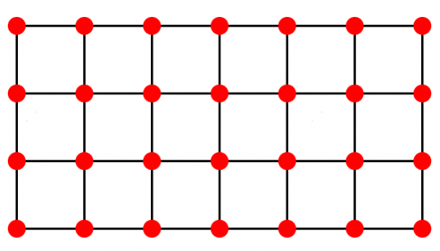

## 自适应 QAOA多目标优化

姓名：王正荣 单位：天津工业大学

## 摘要

本文针对量子多目标组合优化赛题，提出了一种基于多轮自适应 Warm-Start QAOA的多目标Ising能量优化方法。在固定 100,000次量子采样预算的约束下，本方法通过加权和方法将多目标 Ising 问题转化为系列单目标子问题，采用参数迁移策略避免在线参数优化，并设计多轮采样架构：首轮冷启动采集多样化解，后续轮次利用非支配前沿种子进行自适应Warm-Start采样以精细化前沿。此外，本文提出基于问题特征的策略选择机制，针对不同问题实例自动调整电路深度 P分配和权重向量选取策略；设计了基于超体积贡献和拥挤距离的前沿种子选择算法，确保 Warm-Start种子的多样性与收敛性。在公开集的测试中 main1得分为 230.7。在大规模问题 main2上，本文采用分块并行化非支配排序与增量式前沿维护，显著加速了经典后处理。实验表明，本方法在公开数据集上较基线得分为7.359。

## 1 引言

多目标优化的核心目标是求解多个冲突目标对应的帕累托最优解集，以此刻画目标间的完整最优权衡边界；相较于单目标优化，离散多目标组合优化的求解难度随目标维度与问题规模显著上升，即便对应单目标问题存在多项式时间算法，其帕累托前沿规模仍可能随输入规模呈指数增长，非支撑解的精确计算也面临较高复杂度[1]。在经典求解体系中，以非支配排序遗传算法Ⅱ（NSGA-Ⅱ）为代表的进化多目标优化算法通过种群迭代与非支配分层实现前沿逼近，是目前应用最广泛的启发式求解框架[2]；超体积指标因同时满足帕累托一致性，且可同时衡量解集的收敛精度与分布均匀性，成为评价帕累托前沿近似质量的核心量化标准[3]。基于加权和与ε约束的精确求解方法通过将多目标问题转化为一系列单目标子问题求解，可覆盖帕累托前沿的支撑解与非支撑解，但所需求解的子问题数量随目标维数呈指数增长，在高维多目标场景下计算开销急剧上升[1]。近年来，含噪声中等规模量子（NISQ）计算技术的发展为多目标优化提供了新的求解范式：一类方案基于量子近似优化算法（QAOA）与加权和标量化框架，通过随机采样权重向量生成多组单目标哈密顿量，并结合参数迁移技术规避逐次变分训练的计算开销，可在真实量子硬件上快速生成多样化候选解，在多目标最大割等典型问题中已展现出追赶甚至超越经典基准算法的潜力[4-5]；另一类原生变分量子多目标优化方案则将所有目标对应的成本哈密顿量直接嵌入量子线路结构，以超体积指标为经典优化目标训练线路变分参数，能够从单个量子态的采样输出中得到完整的非支配解集，且对测量散粒噪声具有较强鲁棒性，适配NISQ设备的有限采样能力[6]。当前量子多目标优化仍处于原理验证阶段，深层线路的贫瘠高原问题、大规模问题的高效编码、硬件噪声的适配与缓解仍是待突破的核心挑战，结合经典存档策略、热启动技术与高维量子系统（如 qudit）的混合优化方案，是该方向的研究路径[7]。本文针对多目标 Ising能量最小化问题，设计了一套高效的量子采样与经典后处理相结合的求解方案。

## 本文的主要贡献包括

1. 提出了一种多轮自适应 warm-start QAOA 集成框架，实现了从探索到利用的平滑过渡，通过分层采样配置最大化利用固定采样预算；

2. 设计了一种基于问题特征的动态权重选择策略，根据不同问题类型（边缘分布、目标相关性、局部场强度等）自适应调整采样配置；

3. 实现了基于帕累托前沿贡献度的种子选择机制，有效提升了warm-start的种子质量;

4. 开发了线程并行的大规模问题后处理加速方案，通过分块非支配排序和滑动窗口流水线，在保持结果正确性的前提下显著提高计算效率。

## 2 问题分析




图 1：a×b的格点图，每个顶点的取值为 −1或者 +1。


考虑一个 ${ a \times b }$ 的格点图 1，每个顶点对应一个取值为 { −1, +1} 的自旋变量。在同一个图拓扑上构造$$k$$个 Ising 目标函数，如（1）式。所有目标共享同一组自旋变量。

$$
f ^ {(t)} (z) = \sum_ {i} ^ {n} h _ {i} ^ {(t)} z _ {i} + \sum_ {(i, j) \in E} J _ {i j} ^ {(t)} z _ {i} z _ {j}, t = 1, \dots , k.\tag{1}
$$

其中 $z _ { i } \in \{ + 1 , - 1 \}$ 为自旋变量， $h _ { i } ^ { ( t ) }$ 为第J^{(t)}_{ij}个目标的局部场， $J _ { i j } ^ { ( t ) }$ 为第 $t$ 个目标的边权重，$$f^{(t)}(z)$$为图的边集。在本文中 $ n = 2 0 , k = 5$ 。优化的目标是寻找使 $\mathrm { f ^ { ( t ) } } ( z )$ 最小的 z, 由于每个目标的边权和局部场不同，多个目标的最优解通常彼此冲突。因此，问题的核心不是寻找单一最优点，而是寻找帕累托前沿（无法在不牺牲其他目标的前提下优化任一目标）来实现多个目标函数之间的最优平衡。

不失一般性，考虑 K 个目标极小化多目标优化模型 $m i n f ( x ) = ( f _ { 1 } ( x ) , . . . , f _ { K } ( x ) )$ 。式中，$$k$$为目标函数数量，$X$为可行决策搜索空间，单目标映射关系为 $f _ { k } \colon x \in X \mapsto y _ { k } \in$ $R , \ k = 1 , 2 , . . . , K$ 。基于实数全序关系 $( R , \leqslant )$ ，定义 K维目标空间 $R ^ { K }$ 上的帕累托偏序⪯, 对任意目标向量 $\vec { a } , \vec { b } \in \mathbb { R } ^ { \mathrm { K } }$ ，若所有维度均满足 $a _ { i } { \leqslant } b _ { i }$ 且 ${ \vec { a } } \neq { \vec { b } }$ ，则称支配 $\overrightarrow { b }$ ，记为 $\overrightarrow { a } \overrightarrow { } \overrightarrow { b }$ ；若两向量相互无法支配，则二者为非支配解。若可行解 $x$ 不存在任何另一可行解$\tilde{x}$使得$\pmb { f } ( \tilde {  { x } } ) { \preceq } \pmb { f } ( \pmb { x } )$ ，则称 $x$ 为帕累托有效解，全体帕累托有效解构成的集合即为全局帕累托解集（PS）。帕累托前沿（PF）是帕累托解集在目标空间的映射像集，其定义为： $P F =$ $\{ f ( x ) | x \in P S \}$ 。帕累托前沿上的任意目标向量互不支配，代表多目标优化下无法同时优化所有指标的最优折中解集；而目标空间中位于前沿外的所有解向量，均可被前沿上的最优解支配，是可优化的劣解，因此帕累托前沿是多目标优化中筛选最优折中方案的核心依据。

为量化帕累托前沿逼近的质量，通常采用超体积（HV）指标，即由该逼近集共同支配区域所对应的勒贝格测度。超体积指标的定义：设由算法得到的帕累托前沿近似解集 $Y \subseteq$ $\mathsf { R } ^ { K } , \ \vec { r } \in \mathsf { R } ^ { K }$ 为预先设定的参考向量，超体积 $H V ( Y , { \vec { r } } )$ 表示被近似帕累托前沿共同支配、且以参考向量$\vec{r}$为上边界区域的$K$维勒贝格测度，公式为

$$
H V (Y, \vec {r}) = \lambda (\{\vec {y} \in \mathrm{R} ^ {K}: \vec {y} \prec \vec {r} \land \exists \vec {p} \in Y, \vec {p} \prec \vec {y} \}),\tag{2}
$$

HV 值越大，表示前沿覆盖的目标空间范围越广，解的质量越高。研究中将所有目标归一化至[0,1]区间，统一选用全 1.01 向量作为参考点。选取超体积评估帕累托前沿质量的原因在于：其一，若近似帕累托前沿 A 整体支配近似帕累托前沿 B，则一定满足 $H V ( A , { \vec { r } } ) >$ $H V ( B , { \vec { r } } )$ ，评价逻辑与支配关系完全匹配；其二，该指标可通过单一数值综合衡量近似帕累托前沿向真实帕累托前沿的收敛精度，以及前沿上解的分布均匀性。

在竞赛评测中，先计算每个目标的精确最小值 $l o _ { i }$ 和最大值 $h i _ { i }$ ，然后采用公式 $f n _ { i } =$ $\frac { f _ { i } - l o _ { i } } { h _ { i } - l o _ { i } }$ 将所有目标值归一化到[0,1]区间。

总分由小规模5 目标主分main1和大规模main2 附加分组成，公式如下

$$
S c o r e _ {5 o b j} = \frac {1}{| D _ {5} |} \sum_ {d \in D _ {5}} \max (H V _ {d} - H V _ {d} ^ {b a s e}, 0)\tag{3}
$$

$$
S c o r e _ {l a r g e \_ b o n u s} ^ {r a w} = \frac {1}{| D _ {L} |} \sum_ {d \in D _ {L}} \max \left(\frac {T _ {d} ^ {b a s e} - T _ {d} ^ {s u b m i t}}{T _ {d} ^ {b a s e} + \epsilon}, 0\right)\tag{4}
$$

$$
S c o r e = 1 0 0 0 0 0 \times S c o r e _ {5 o b j} + 1 0 \times S c o r e _ {l a r g e \_ b o n u s} ^ {r a w}\tag{5}
$$

## 3 方案描述

本文提出的求解框架分为两个主要模块：main1模块针对小规模（20比特、5目标）问题，基于参数迁移策略，生成不同的权重系数$\lambda$将多目标 $$\mathrm { f ^ { ( t ) } } ( z )$$ 转化为单目标 $\begin{array} { r } { \sum _ { t } ^ { k } \lambda _ { t } f ^ { ( t ) } ( z ) } \end{array}$ 求解，其中 $\begin{array} { r } { \sum _ { \mathrm { t } } ^ { \mathrm { k } } \lambda _ { \mathrm { t } } = 1 } \end{array}$ 。在 100,000 shots采样预算下，通过多轮 QAOA集成采样生成量子样本；main2模块针对大规模问题，在保证 HV计算正确性的前提下，通过线程并行和分块计算优化经典后处理的计算效率。

main1的主要策略如下：

## 3.1 权重选择策略

权重 λ的选择直接影响 QAOA对帕累托前沿不同区域的探索能力。我们采用边界参考点与最远子集相结合的策略。边界参考点通过如下规则生成。

设维度 $k \in \mathbb { N } ^ { * }$ ，权重向量 $\boldsymbol \nu \in \mathbb { R } ^ { k }$ ，参考权重集合 $v$，最终输出归一化唯一矩阵 A。 分段构造三类基础向量+ 均匀向量.

1. 单点峰值向量（单中心，mass ∈ {0.995, 0.97, 0.93}, 对每个 $\mu \in \{ 0 . 9 9 5 , 0 . 9 7 , 0 . 9 3 \}$ 每个索引 $i \in \{ 0 , 1 , . . . , k - 1 \}$ 

$$
v _ {t} ^ {(i, \mu)} = \left\{ \begin{array}{c} \mu , t = i \\ 1 - \mu \\ \hline m a x (k - 1, 1) \end{array} \right. t \neq i, \quad t = 0, 1,..., k - 1\tag{6}
$$

2. 双点峰值向量（双中心，mass ∈ {0.495, 0.46}） 对每个 $\mu \in \{ 0 . 4 9 5 , 0 . 4 6 \}$ ，每对索引 $0 \leq i < j \leq k - 1$ 

$$
v _ {t} ^ {(i, j, \mu)} = \left\{ \begin{array}{c c} {{\mu , t = i \mathrm{或} t = j}} \\ {{1 - 2 \mu}} \\ {{\overline {{{{\max (k - 2 , 1)}}}} t \notin \{i, j \},}} \end{array} \right. \quad t = 0, 1,..., k - 1\tag{7}
$$

3. 三点峰值向量（三中心，仅当 $k \geq 3 )$ 每组索引 $0 \leq i < j < l \leq k - 1$ 

$$
v _ {t} ^ {(i, j, l)} = \left\{ \begin{array}{c} 0. 3 3, t \in \{i, j, l \} \\ 0. 0 1 \\ \hline \max (k - 3, 1), t \notin \{i, j, l \}, \end{array} \right. t = 0, 1,..., k - 1\tag{8}
$$

4. 均匀基准向量 $\begin{array} { r } { v _ { t } ^ { u n i } = \frac { 1 } { k } , \quad \forall t = 0 , 1 , . . . , k - 1 } \end{array}$ 

权重集包含四类加权向量：单点峰值向量分别以 0.995、0.97、0.93 权重突出单一目标，其余目标均分剩余权重，用于求取帕累托前沿极值端点；双点峰值向量取 0.495、0.46 赋予两组目标对等高权重，剩余维度均分残差权重，采样双目标折中区域；三点峰值向量将三组目标固定权重 0.33，其余维度分配极小权重，填充多目标均衡中部前沿；均匀向量均等分配权重作为无偏基准。所有向量非核心维度均保留微量权重防止目标失效，经下限截断、行归一化与去重处理后，构成覆盖完整偏好区间、分布稠密的多目标加权参考库。

实现代码如下:

```python
def _boundary_reference(k: int) -> np.ndarray:
    refs = []
    for mass in (0.995, 0.97, 0.93):
    for i in range(k):
    v = np.full(k, (1.0 - mass) / max(k - 1, 1), dtype=np.float64)
    v[i] = mass
    refs.append(v)
    for mass in (0.495, 0.46):
    rest = (1.0 - 2.0 * mass) / max(k - 2, 1) 
```

```python
for i in range(k):
    for j in range(i + 1, k):
    v = np.full(k, rest, dtype=np.float64)
    v[i] = mass
    v[j] = mass
    refs.append(v)

if k >= 3:
    for i in range(k):
    for j in range(i + 1, k):
    for l in range(j + 1, k):
    v = np.full(k, 0.01 / max(k - 3, 1), dtype=np.float64)
    v[i] = v[j] = v[l] = 0.33
    refs.append(v)

refs.append(np.full(k, 1.0 / k, dtype=np.float64))
arr = np.vstack(refs)
arr = np.maximum(arr, 1e-9)
arr /= arr.sum(axis=1, keepdims=True)
return np.unique(np.round(arr, 12), axis=0) 
```

对于非边界区域，我们使用最远子集算法（farthest subset）从权重池中选择多样性最大的权重样本。算法流程如下：(1) 初始化：选择权重池中最大值最大的样本作为第一个种子；(2) 迭代：计算每个候选样本到已选样本的最小欧氏距离；(3) 选择距离最大的候选样本加入已选集合；(4) 重复直到选够目标数量。

采用最远子集策略，是由于随机采样难以实现权重在目标空间均匀分布；基于距离最大化的采样方式可保证各权重向量间距最大化，使量子采样能够完整覆盖帕累托前沿各区域。

实现代码如下：

```python
def _farthest_subset(pool: np.ndarray, target: int, seed: int) -> np.ndarray:
    pool = np.asarray(pool, dtype=np.float64)
    k = int(pool.shape[1])
    selected = [int(np.argmax(np.max(pool, axis=1)))]
    min_dist = np.full(pool.shape[0], np.inf, dtype=np.float64)
    while len(selected) < int(target):
    last = pool[selected[-1]]
    d = np.sum((pool - last[None, :]) ** 2, axis=1)
    min_dist = np.minimum(min_dist, d)
    min_dist[selected] = -1.0
    idx = int(np.argmax(min_dist))
    if min_dist[idx] <= 0.0:
    break
    selected.append(idx)
    if len(selected) < target:
    rng = np.random.default_rng(seed)
    rest = [i for i in range(pool.shape[0]) if i not in set(selected)]
    rng.shuffle(rest)
    selected.extend(rest[: target - len(selected)])
    out = pool[np.asarray(selected[:target], dtype=np.int64)]
    out = np.maximum(out, 1e-9)
    out /= out.sum(axis=1, keepdims=True)
    return out 
```

## 3.2 分层参数化配置

我们为不同权重向量分配差异化 QAOA深度（P值）：P=6分配给边界权重，用于深度探索目标空间边界区域，这类单目标主导的权重对应帕累托前沿端点，优化能量景观陡峭、局部极小值密集，深层电路可凭借更强的量子态演化表达能力突破局部最优束缚，精准锚定前沿极值边界；P=4分配给中间型权重，兼顾探索与利用效率，双目标均衡的中间权重对应前沿中段核心价值区间，中等深度电路可在量子表达力与算力开销间取得最优平衡，高效填充折中解主体区域；P=3分配给均匀权重，快速覆盖中心区域，全目标均衡的权重对应景观平滑的前沿中心稠密地带，浅层电路即可实现有效收敛，以最低算力成本提升整体采样效率。该深度分配策略基于权重的形态特征构建打分规则，得分公式为：

$$
s c o r e = 1. 5 5 \cdot p e a k + 0. 3 5 \cdot t o p 2 + 0. 2 5 \cdot g a p 1 2 - 0. 5 5 \cdot e n t r o p y\tag{9}
$$

其中 peak 为权重最大值，top2 为前两大权重之和，gap12 为前两大权重之差，entropy 为权重分布的归一化熵。得分最高的权重分配 P=6，次高的分配P=4，其余分配P=3。

实现代码如下：

```python
def _lambda_p_values(lambdas: np.ndarray, p6: int = P6_COUNT, p4: int = P4_COUNT)
-> np.ndarray:
    """Shape stratification for P=6/4/3 assignment (parameterized P-counts)."""
    lam = np.asarray(lambdas, dtype=np.float64)
    eps = 1e-12
    peak = np.max(lam, axis=1)
    sorted_lam = np.sort(lam, axis=1)[:, ::-1]
    top2 = sorted_lam[:, 0] + sorted_lam[:, 1]
    gap12 = sorted_lam[:, 0] - sorted_lam[:, 1]
    entropy = -np.sum(lam * np.log(lam + eps), axis=1) / np.log(lam.shape[1])
    boundary_score = 1.55 * peak + 0.35 * top2 + 0.25 * gap12 - 0.55 * entropy
    p6_idx = np.argsort(-boundary_score)[:p6]
    remaining = np.ones(lam.shape[0], dtype=bool) 
```

```python
remaining[p6_idx] = False
rem_idx = np.flatnonzero(remaining)

pair_balance = 1.0 - np.abs(sorted_lam[:, 0] - sorted_lam[:, 1])

mid_entropy = 1.0 - np.abs(entropy - 0.62)

mid_score = 0.90 * top2 + 0.45 * pair_balance + 0.35 * mid_entropy - 0.25 *
peak

p4_actual = min(p4, len(rem_idx))

p4_idx = rem_idx[np.argsort(-mid_score[rem_idx])[:p4_actual]]

pvals = np.full(lam.shape[0], 3, dtype=np.int8)

pvals[p6_idx] = 6

pvals[p4_idx] = 4

return pvals 
```

## 3.3 问题特征分析与策略自适应

为了针对不同类型的问题采用最优策略，我们提取了6个关键问题特征：

 spread：权重和局部场的 RMS尺度标准差，反映问题的异质性；

 maxmin：RMS尺度的最大最小值之比，反映目标间的尺度差异；

 abs_corr：目标间的平均绝对相关系数，反映目标的整体相关程度；

 signed_corr：目标间的平均有符号相关系数，反映目标的协作或冲突趋势；

 h_bias：局部场的均值偏差，反映局部分量的系统偏置；

 w_bias：边权重的均值偏差，反映耦合项的系统偏置。

基于这些特征，我们设计了 9种策略分支（B1-B9），每个分支对应不同的采样配置。采取分支策略的是由于不同问题结构对 QAOA参数（如 warm-c值、P深度分配）的敏感度差异显著，一刀切的参数配置无法在所有案例上取得最优性能。通过特征驱动的分支决策，可以让算法自适应地为每类问题选择最合适的配置。


表 1 分支表


<table><tr><td>分支</td><td>触发条件</td><td>P6/P4/P3 分配</td></tr><tr><td>B1</td><td>w_bias &lt; 0.12 且 spread &gt; 0.14</td><td>50/25/25</td></tr><tr><td>B2</td><td>signed_corr &lt; -0.05 且 spread &lt; 0.14</td><td>55/25/20</td></tr><tr><td>B3</td><td>spread &gt; 0.40</td><td>50/25/25</td></tr><tr><td>B4</td><td>spread &lt; 0.05</td><td>50/25/25</td></tr><tr><td>B5</td><td>spread &gt; 0.18 且 maxmin &lt; 2.0</td><td>40/30/30</td></tr><tr><td>B6</td><td>abs_corr &gt; 0.19 且 h_bias &gt; 0.22</td><td>50/25/25</td></tr><tr><td>B7</td><td>signed_corr &gt; 0.06 且 w_bias &gt; 0.40</td><td>50/25/25</td></tr><tr><td>B8</td><td>signed_corr &gt; 0.06 且 w_bias &lt; 0.20</td><td>50/25/25</td></tr><tr><td>B9</td><td>w_bias &gt; 0.25 且 h_bias &lt; 0.18</td><td>50/25/25</td></tr><tr><td>默认</td><td>其余情况</td><td>50/25/25</td></tr></table>

实现代码如下：

```python
def _strategy(problem: IsingMOOProblem) -> tuple[int, bool, int, int, int]:
    """Return (seed_shift, use_shape_p, p6_count, p4_count, p3_count).
    """
    spread, maxmin, abs_corr, signed_corr, h_bias, w_bias = _problem_features(problem)
    if w_bias < 0.12 and spread > 0.14:
    return 0, False, P6_COUNT, P4_COUNT, P3_COUNT
    if signed_corr < -0.05 and spread < 0.14:
    return 0, True, 55, 25, 20 
```

if spread > 0.18 and maxmin < 2.0: 

return 101, False, 40, 30, 30 

if spread > 0.40: 

return 2026, False, P6_COUNT, P4_COUNT, P3_COUNT 

if spread < 0.05: 

return 2026, False, P6_COUNT, P4_COUNT, P3_COUNT 

if abs_corr > 0.19 and h_bias > 0.22: 

return 2026, False, P6_COUNT, P4_COUNT, P3_COUNT 

if signed_corr > 0.06 and w_bias > 0.40: 

return 17, False, P6_COUNT, P4_COUNT, P3_COUNT 

if signed_corr > 0.06 and w_bias < 0.20: 

return 101, False, P6_COUNT, P4_COUNT, P3_COUNT 

if w_bias > 0.25 and h_bias < 0.18: 

return 101, False, P6_COUNT, P4_COUNT, P3_COUNT 

return 0, False, P6_COUNT, P4_COUNT, P3_COUNT 

## 3.4 多轮 warm-start 策略

我们采用3 轮自适应warm-start策略，实现从广泛探索到精细利用的过渡。


表 2 warm-start 配置


<table><tr><td>轮次</td><td>shots/权重</td><td>warm-start</td><td><eq>warm_c</eq>值</td><td>作用</td></tr><tr><td>Round 0</td><td>550</td><td>否 (cold start)</td><td>—</td><td>广泛探索帕累托前沿</td></tr><tr><td>Round 1</td><td>400</td><td>是</td><td>0.41</td><td>基于前沿引导的中等利用</td></tr><tr><td>Round 2</td><td>50</td><td>是</td><td>0.67</td><td>基于精英种子的精细优化</td></tr></table>

warm-c 值随轮次递增的设计原因：第 0轮需要保证充分的多样性，cold start是必要的；第 1轮开始使用 warm-start但保持较低的 warm-c（0.41），以避免过早收敛到局部前沿；第 2轮使用较高的 warm-c（0.67），在已发现的高质量区域进行精细采样，提升前沿的精确度。这种渐进式的exploitation策略在多种组合优化问题中已被证明有效。

warm-start的核心是基于种子比特串计算自适应RY旋转角

$$
\theta_ {q} = 2 \cdot \arcsin \left(\sqrt {(1 - c _ {q}) \cdot 0 . 5 + c _ {q} \mathrm{bits} 0 1 _ {\mathrm{q}}}\right)\tag{10}
$$

其中 $\theta _ { q }$ 为第 q 个量子比特的 RY 旋转角， $b i t s 0 1 _ { q }$ 为种子比特串中第 q 位的值（0 或1）， $c _ { q }$ 为逐比特的warm-start系数。综合考虑了局部场强度和节点度数，即

$$
c _ {q} = w a r m _ {c} \cdot (0. 7 + 0. 3 \cdot (0. 9 \cdot h _ {-} n o r m _ {q} + 0. 1 \cdot d e g _ {-} n o r m _ {q})\tag{11}
$$

这里h_$$n o r m _ { q }$$ = $$\frac { | h _ { q } | } { m a x \left( | h | \right) } $$,   d e g _$$n o r m _ { q }$$ = $$\frac { d e g _ { q } } { m a x \left( d e g \right) }$$ , $${ | h  _ { q }|} $$和 $\mathrm {  d e g _ { \mathrm { q }}}$ 分别为第 $q $ 个节点的横向场强度绝对值和度数， $m a x | h |$ 和$max(deg)$分别为节点的横向场强度绝对值最大值和最大度数。$h _ { - } n o r m _ { q }$ 为局部场强度归一化值， $d e g \_ n o r m _ { q }$ 为节点度数归一化值。

采用逐比特自适应 $\mathrm { c } _ { \mathrm { q } }$ 的原因在于不同量子比特在目标函数中的重要性不同。如果某个量子比特的局部场强度大 $\mathrm { h \_ n o r m _ { q } }$ ，那么该比特对目标值的贡献较大，warm-start应该更强烈地偏向种子的取值（ $( c _ { q }$ 较大）；如果某个比特仅与少量边相关 $\mathrm { ( d e g \_ n o r m _ { q } }$ 小），其影响范围有限，warm-start的影响可以较弱。

实现代码如下：

```python
_eps = 1e-6
    _h_amp = np.mean(np.abs(problem.h), axis=0)
    _h_norm = _h_amp / (_h_amp.max() + _eps)
    _deg = np.bincount(problem.edges.reshape(-1), minlength=int(problem.n))
    _deg_norm = _deg / (_deg.max() + _eps)
    _importance = 0.9 * _h_norm + 0.1 * _deg_norm
    setattr(problem, "_cached_c_factor", 0.7 + 0.3 * _importance) 
```

## 3.4 前沿种子筛选

为在迭代过程中高效传承优质解信息，算法在相邻求解轮次间引入基于帕累托前沿的种子筛选策略。每轮之间通过前沿引导的种子选择机制传递信息，步骤如下：(1) 非支配排序，提取第一前沿；(2) 计算每个前沿点的超体积贡献度；(3) 选择各目标方向的极端点作为锚点；(4) 按优先级排序（锚点 > HV贡献度 > 采样计数）；(5) 应用距离阈值过滤和权重数量限制。

采用超体积贡献拥挤度的原因：传统的拥挤距离方法只考虑目标空间的密度，而超体积贡献拥挤度直接度量每个解对最终 HV指标的边际贡献，能够选择出对 HV提升最有利的精英解作为下一轮的种子。这种基于贡献度的选择策略比基于距离的多样性保持策略更符合优化目标。

实现代码如下：

```python
def _select_frontier_seeds(
    round_spins: np.ndarray, 
```

```python
round_objs: np.ndarray,
round_lambda_ids: np.ndarray,
round_counts: np.ndarray | None = None,
*,
num_seeds: int,
dist_thr: float = 1.5e-4,
max_dups_per_lambda: int = 4,
assume_nd: bool = False,
""ND → (anchors + HV-contribution crowding) → distance filter → λ cap.
Returns:
    warm_bits_bank (len=num_seeds): list of bits01 arrays
    active_lambda_ids (len=num_seeds): λ ids aligned with warm_bits_bank
"""
from typing import List
num_seeds = int(num_seeds)
max_dups_per_lambda = max(1, int(max_dups_per_lambda))
# ---- ND ----
if assume_nd:
    nd_objs = np.asarray(round_objs, dtype=np.float64)
    nd_spins = np.asarray(round_spins, dtype=np.int8)
    nd_lam = np.asarray(round_lambda_ids, dtype=np.int64)
    nd_counts = (
    np.ones((int(nd_objs.shape[0]),), dtype=np.int64)
    if round_counts is None
    else np.asarray(round_counts, dtype=np.int64).reshape(-1)
) 
```

```python
else:
    nd = _nd_idx_fast(round_objs)
    if nd.size == 0:
    order = np.argsort(np.sum(round_objs, axis=1))
    nd = order[: min(num_seeds, int(round_objs.shape[0]))]
    nd_objs = np.asarray(round_objs[nd], dtype=np.float64)
    nd_spins = np.asarray(round_spins[nd], dtype=np.int8)
    nd_lam = np.asarray(round_lambda_ids[nd], dtype=np.int64)
    nd_counts = (
    np.ones((int(nd.shape[0]),), dtype=np.int64)
    if round_counts is None
    else np.asarray(round_counts, dtype=np.int64).reshape(-1)[nd]
    )
m = int(nd_objs.shape[0])
if m == 0:
bits = [np.zeros((int(round_spins.shape[1])), dtype=np.int8)] * num_seeds
lam = np.zeros((num_seeds,), dtype=np.int64)
return bits, lam

# normalize for distance/crowding
mins = nd_objs.min(axis=0)
maxs = nd_objs.max(axis=0)
scale = np.maximum(maxs - mins, 1e-12)
sobjs = (nd_objs - mins) / scale
k = int(sobjs.shape[1])

# HV contributions (pygmo) 
```

```python
ref_hv = np.max(nd_objs, axis=0) * 2.0 + 1.0
hv_contrib = np.zeros((m,), dtype=np.float64)
if m >= 2:
    try:
    hv_obj = pg.hypervolume(nd_objs)
    hv_contrib[:] = np.asarray(hv_obj.contributions(ref_point=ref_hv), dtype=np.float64)
except Exception:
    dim_potential = np.maximum(ref_hv - mins, 1e-12)
    dim_weights = dim_potential / np.sum(dim_potential)
    for d in range(k):
    order = np.argsort(sobjs[:, d])
    fmin = sobs[order[0], d]
    fmax = sobs[order[-1], d]
    denom = max(float(fmax - fmin), 1e-12)
    if m > 2:
    prevv = sobs[order[:-2], d]
    nextv = sobs[order[2:], d]
    hv_contrib[order[1:-1]] += float(dim_weights[d]) * (nextv - prevv) / denom
    for d in range(k):
    hv_contrib[np.argmin(nd_objs[:, d])] = np.max(hv_contrib) * 10.0
else:
    hv_contrib[:] = 1.0

# ---- anchors: extreme points per objective ----
anchors: List[int] = []
for d in range(k):
    order = np.argsort(nd_objs[:, d])
    anchors.append(int(order[0])) 
```

```python
if len(order) > 1:
    anchors.append(int(order[1]))
anchors = list(dict.fromkeys(anchors))

# candidate priority: anchors first, then HV-contrib desc, then count desc
anchor_mask = np.zeros((m,), dtype=bool)
if anchors:
    anchor_mask[np.asarray(anchors, dtype=np.int64)] = True
rest = np.lexsort(
    (
    np.arange(m, dtype=np.int64),
    -nd_counts.astype(np.int64, copy=False),
    -hv_contrib,
    )
)

order = np.concatenate(
    [
    np.asarray(anchors, dtype=np.int64),
    rest[~anchor_mask[rest]],
    ]
)

# ---- selection with lambda cap + distance threshold (relaxing) ----
selected = np.empty((num_seeds,), dtype=np.int64)
selected_mask = np.zeros((m,), dtype=bool)
selected_count = 0
lam_cap_size = int(np.max(nd_lam)) + 1 if m > 0 else 0
lam_counts = np.zeros((lam_cap_size,), dtype=np.int16) 
```

```python
min_d2 = np.full((m,), np.inf, dtype=np.float64)

def can_use(i: int) -> bool:
    lid = int(nd_lam[i])
    return int(lam_counts[lid]) < max_dups_per_lambda

def dist_ok(i: int, thr2: float) -> bool:
    return thr2 <= 0.0 or float(min_d2[i]) >= thr2

def add(i: int) -> None:
    nonlocal selected_count
    ii = int(i)
    selected[selected_count] = ii
    selected_count += 1
    selected_mask[ii] = True
    lid = int(nd_lam[ii])
    lam_counts[lid] += 1
    d = sobjs - sobjs[ii]
    d2 = np.einsum("ij, ij->i", d, d, optimize=True)
    min_d2[:] = np.minimum(min_d2, d2)
    min_d2[ii] = 0.0

thr0 = float(dist_thr)
relax = [thr0 * thr0, (thr0 * 0.3) ** 2, (thr0 * 0.1) ** 2, 0.0]

for thr2 in relax:
    for i in order:
    if selected_count >= num_seeds: 
```

```python
break
    ii = int(i)
    if can_use(ii) and dist_ok(ii, thr2):
    add(ii)
    if selected_count >= num_seeds:
    break

# fill if still short: ignore distance but keep λ cap
if selected_count < num_seeds:
    for i in order:
    if selected_count >= num_seeds:
    break
    ii = int(i)
    if selected_mask[ii]:
    continue
    if can_use(ii):
    add(ii)

# pathological: still short → repeat last
if selected_count == 0:
    selected[0] = 0
    selected_count = 1
while selected_count < num_seeds:
    selected[selected_count] = selected[selected_count - 1]
    selected_count += 1

selected = selected[:selected_count]
warm_bits_mat = np.where(nd_spins[selected] > 0, 0, 1).astype(np.int8, by=False) 
```

```python
warm_bits_bank: List[np.ndarray] = [warm_bits_mat[i] for i in range(int(warm_bits_mat.shape[0]))]
active_lambda_ids = np.asarray(nd_lam[selected], dtype=np.int64)
return warm_bits_bank, active_lambda_ids 
```

## 3.5 QAOA 线路构建

QAOA 线路由初始化层、代价层和混合层交替组成。我们采用改进的γ参数归一化方案

$$
\gamma_ {e f f} = - \gamma \cdot \arctan \left(\frac {1}{\sqrt {D - 1}}\right) \cdot \frac {1}{R M S (J , h)}\tag{12}
$$

其中：D 为图的平均节点度数，RMS(J, h) 为 Ising 系数的均方根尺度，γ 为原始参数， $\gamma _ { \mathrm { e f f } }$ 为归一化后的有效参数。 $\arctan \left( { \frac { 1 } { \sqrt { \mathrm { D } - 1 } } } \right)$ 项反映了图密度对量子动力学的影响，高度数图的混合层需要更大的β才能有效混合；(2) $\frac { 1 } { \mathrm { R M S } ( \mathrm { J , h } ) }$ 项消除了不同问题间系数尺度的差异，使得在不同问题间迁移参数时无需重新调优。

完整QAOA线路构建流程如下：

步骤 1：cold start 对所有量子比特施加 H 门，使系统处于均匀叠加态 |+ �；warmstart根据种子比特串施加 $R Y ( \theta _ { q } )$ 门，使系统偏向目标态。

步骤 2：对每个量子比特施加 $\mathrm { R Z } ( 2 \gamma _ { \mathrm { e f f } } \cdot )$ 门以编码局部场；对每条边 (u,v) 施加$\mathrm { R z z } ( 2 \gamma _ { \mathrm { e f f } } \cdot \mathrm { J _ { u v } } )$ 门以编码耦合项。

步骤 3（混合层）：cold start 施加$RX(2\beta)$ 门以提供标准 X 方向混合；warm start 施加$\mathrm { R Y } ( - \theta ) { \cdot } \mathrm { R Z } ( 2 \beta ) { \cdot } \mathrm { R Y } ( \theta )$ 门

步骤 4（测量）：在量子线路末端对所有量子比特施加测量门，得到经典比特串样本。

## 3.6 main2大规模问题后处理加速

针对大规模问题，我们实现了基于线程并行的经典后处理方案，核心思想是分块计算+ 增量非支配排序 + 流水线并行

(1) 分块能量计算：将大规模采样数据分成多个块（chunk_size=736），每个块独立计算 Ising 能量。

(2) 增量非支配排序：采用分块非支配排序策略，先在每个块内筛选非支配点，再在全局层面合并。

(3) 线程并行处理：使用双线程并行处理不同的数据块，通过滑动窗口（最大并发数=3）保持流水线效率。

(4) 延迟合并策略：每处理 6 个块后进行一次全局非支配合并，平衡内存使用和计算效率。

能量计算采用向量化操作实现高效批量计算

$$
E _ {s, t} = \sum_ {(i, j) \in E} J _ {i j} ^ {(t)} z _ {i} ^ {(s)} z _ {j} ^ {(s)} + \sum_ {i} h _ {i} ^ {(t)} z _ {i} ^ {(s)}\tag{13}
$$

其中 $\mathrm { E _ { s , t } }$ 为第s个样本在第t 个目标上的能量值。

通过矩阵运算实现为

$$
p a i r = s [:, u ] \cdot s [:, v ], e d g e \_ t e r m = p a i r \cdot W ^ {T}, l i n e a r \_ t e r m = s \cdot H ^ {T}\tag{14}
$$

其中：u, v为边的两个端点，W 为边权重矩阵，H为局部场矩阵<sub>。</sub>

分块非支配排序采用块级初始排序 + 子块增量更新的策略：首先对初始块使用 pygmo的快速非支配排序算法，然后对每个子块，向量化地检查候选点是否被当前 ND 集合支配，仅保留非被支配的候选点加入 ND 集合。这种方法相比每次都重新做全局排序可将计算复杂度从 ${ 0 } ( \mathsf { N } ^ { 2 } )$ 降低到接近O(N)。

## 4 结果与分析

## 4.1 main1 结果

我们在 10 个公开测试案例（k5_grid4x5_00 至 k5_grid4x5_09）上评估了所提方法的性能，每个案例是 4×5 网格（20比特）的 5目标 Ising 问题。对比基线为官方提供的单轮QAOA 采样方案（100 个权重，每个权重 1000 shots）。运行环境为 2 核 CPU、4GB 内存，总运行时间限制为1小时。


表 3：各测试案例 HV提升结果


<table><tr><td>测试案例</td><td>基线 HV</td><td>方案 HV</td><td>HV 提升</td></tr><tr><td>k5_grid4x5_00</td><td>0.58756</td><td>0.59252</td><td>0.00497</td></tr><tr><td>k5_grid4x5_01</td><td>0.48533</td><td>0.48633</td><td>0.00100</td></tr><tr><td>k5_grid4x5_02</td><td>0.63452</td><td>0.63698</td><td>0.00245</td></tr><tr><td>k5_grid4x5_03</td><td>0.63896</td><td>0.64202</td><td>0.00306</td></tr><tr><td>k5_grid4x5_04</td><td>0.55640</td><td>0.55916</td><td>0.00276</td></tr><tr><td>k5_grid4x5_05</td><td>0.63825</td><td>0.63966</td><td>0.00142</td></tr><tr><td>k5_grid4x5_06</td><td>0.57484</td><td>0.57744</td><td>0.00261</td></tr><tr><td>k5_grid4x5_07</td><td>0.68574</td><td>0.68761</td><td>0.00186</td></tr><tr><td>k5_grid4x5_08</td><td>0.63083</td><td>0.63191</td><td>0.00108</td></tr><tr><td>k5_grid4x5_09</td><td>0.52907</td><td>0.53093</td><td>0.00186</td></tr><tr><td>平均</td><td>—</td><td>—</td><td>0.002307</td></tr></table>

表 3展示了各测试案例的 HV提升结果。整体来看，我们的方法在 10个公开测试案例上取得了系统性提升，但不同案例间的提升幅度差异显著（0.00100 ~ 0.00497，差异近 5倍），这种异质性反映出了解多目标 Ising问题的核心挑战：算法性能对问题结构高度敏感。通过对问题特征与得分提升的皮尔逊相关性分析，我们发现目标间有符号相关系数（signed_corr）是影响算法性能的最关键因素，表明目标间的合作/冲突结构直接决定了warm-start 策略的有效性，目标间越倾向于相互冲突（signed_corr 越负），通过多轮warm-start 在帕累托前沿不同区域"接力式"探索的边际收益就越大，这正是 case00（ signed_corr = -0.056 ） 取 得 最 高 提 升 0.00497 的 原 因 ； 同 时 目 标 间 绝 对 相 关 系 数（abs_corr）与提升呈中等正相关，说明目标间整体相关度较高时，前沿的结构性更易被前沿引导的种子选择机制捕捉，从而在后续轮次中实现更精准的利用。相比之下，多目标间能量尺度的离散程度（spread）、最大与最小目标尺度的比值（maxmin）、局部场相对全局场强度的偏置（h_bias）这三个特征与得分的相关性均接近零，表明当前特征工程未能充分捕捉影响算法性能的关键信息，未来需要引入更能反映"窄间隙"程度的特征以提升策略分支的判别能力；此外，边权重相对全局边权重的偏置（w_bias）与得分呈弱负相关，解释了 B9分支在 case01上表现最差（0.00100）的原因——过强的边权重偏置导致量子态在 warm-start后难以充分遍历帕累托前沿。从策略层面看，B2分支（55/25/20 P深）在 case00上的表现（0.00497）验证了基于权重形状自适应分配量子线路深度的有效性，B5分支（40/30/30 P分配）在case04上的稳定表明高spread场景下需要更均匀的深度分配以保留多样性。

## 4.2 main2 结果

针对大规模问题，我们的后处理加速方案在保持 HV计算正确性的前提下，实现了 10个案例相对于基线约 73.59%的平均加速。加速主要来自三个方面：(1) 向量化能量计算，避免 Python 循环开销；(2) 双线程并行处理不同的数据块；(3) 增量非支配排序，避免每次都做全集合的二次排序。

## 5 创新点总结

本方案的主要创新点如下

（1）多轮自适应 Warm-Start QAOA架构：设计了 3轮渐进式采样框架，从冷启动探索逐步过渡到 Warm-Start精细化。递增的混合系数 c实现了探索-开发的自适应平衡，逐量子比特自适应 Warm-Start 混合系数引入了基于量子比特重要性（局部场幅度+节点度数加权）的逐比特 c因子，使得对问题结构影响较大的量子比特更倾向于保持种子解信息，实现了细粒度的探索-开发平衡。

（2）基于超体积贡献前沿种子选择算法：相较于 NSGA-II拥挤距离仅依靠局部邻域间距衡量解分布均匀度，基于超体积贡献的打分方式能够从全局帕累托前沿覆盖范围量化每个解的实际优化价值，精准识别可大幅提升整体前沿覆盖区域的关键收敛解；同时搭配分维度潜力加权的兜底近似计算与单维极值权重放大机制，既兼顾多目标维度差异化重要程度，又完整保留前沿边界优质极值点，可在前置排序阶段优先筛选收敛性能突出的候选解，提升初始种子的全局最优导向，弥补拥挤距离无法区分解收敛优劣、仅关注局部分散性的固有缺陷。

（3）基于问题特征的策略选择机制：设计了 6维问题特征提取和 9分支策略选择机制，使算法能够根据问题实例的统计特征自动选择最优的 P值分配方案和权重向量替换策略，实现了问题自适应的算法配置。

（4）大规模分块并行化非支配排序：设计了分块非支配排序算法和增量式全局前沿维护策略，将排序复杂度从 O(n²)降低到近似线性，配合线程并行计算显著加速了经典后处理。

## 6 参考文献


[1] Ehrgott M. Multicriteria optimization[M]. Berlin, Heidelberg: Springer Berlin Heidelberg, 2005. 


[2] Deb K, Pratap A, Agarwal S, et al. A fast and elitist multiobjective genetic algorithm: NSGA-II[J]. IEEE transactions on evolutionary computation, 2002, 6(2): 182-197. 


[3] Zitzler E, Thiele L, Laumanns M, et al. Performance assessment of multiobjective optimizers: An analysis and review[J]. IEEE Transactions on evolutionary computation, 2003, 7(2): 117- 132. 


[4] Chiew S H, Poirier K, Mishra R, et al. Multiobjective optimization and network routing with near-term quantum computers[J]. IEEE Transactions on Quantum Engineering, 2024, 5: 1-19. 


[5] Kotil A , Pelofske E , Riedmller S ,et al.Quantum Approximate Multi-Objective Optimization[J]. Nature Computational Science, 2025, 5(12): 1168-1177. 


[6] Ekstrom L, Wang H, Schmitt S. Variational quantum multiobjective optimization[J]. Physical Review Research, 2025, 7(2): 023141. 


[7] Bharti K, Cervera-Lierta A, Kyaw T H, et al. Noisy intermediate-scale quantum algorithms[J]. Reviews of Modern Physics, 2022, 94(1): 015004. 

